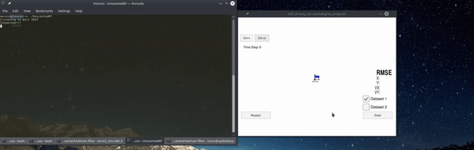
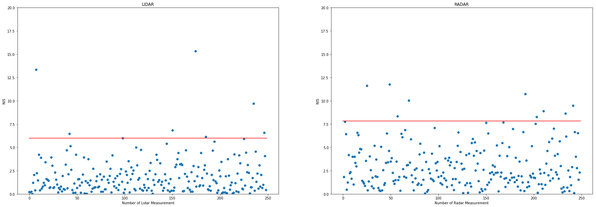

## Unscented Kalman Filter (Self-Driving Car Engineer Nanodegree)

In this project, an unscented Kalman filter is utilized to estimate the state of a moving object of interest with noisy lidar and radar measurements.

This project involves the Udacity Self-Driving Car Engineer Nanodegree Term 2 Simulator which can be downloaded from [here](https://github.com/udacity/self-driving-car-sim/releases).


#### Dependencies

* cmake >= 3.5
* make >= 4.1 (Linux, Mac), 3.81 (Windows)
* gcc/g++ >= 5.4
* [uWebSocketIO](https://github.com/uWebSockets/uWebSockets) with commit hash e94b6e1


#### Build
The Unscented Kalman Filter program can be built and run by doing the following from the project top directory.

```bash
$> mkdir build
$> cd build
$> cmake ..
$> make
```


#### Run
Run from the project top directory.
```bash
$> build/UnscentedKF
```


#### Demo


#### Normalized Innovation Squared Parameter Consistency Check
|                 | LIDAR NIS | RADAR NIS |
|-----------------|-----------|-----------|
| 5th percentile  | 0.149157  | 0.328656  |
| 95th percentile | 4.882348  | 7.604896  |



More statistics can be found in [NIS_Analysis.ipynb](./NIS_Analysis.ipynb).


#### Protocol
Below is the main protcol that main.cpp uses for uWebSocketIO in communicating with the simulator.

*INPUT*: values provided by the simulator to the C++ program:
```
["sensor_measurement"] => the measurement that the simulator observed (either lidar or radar)
```

*OUTPUT*: values provided by the C++ program to the simulator:
```
["estimate_x"] <= kalman filter estimated position x
["estimate_y"] <= kalman filter estimated position y
["rmse_x"]
["rmse_y"]
["rmse_vx"]
["rmse_vy"]
```


#### Notice
For comprehensive instructions on how to install and run project, please, refer to the following repo, which was used as a skeleton for this project: https://github.com/udacity/CarND-Unscented-Kalman-Filter-Project.
